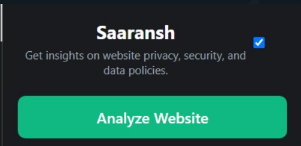
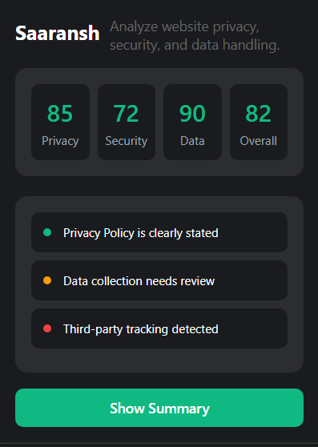

# Saaransh / Legalease Lens

## About

Do you ever read through thousands of line of terms of service and privacy policies of online sites? Do you ever stop and wonder what data do you share with these sites and how they use it?

Fret not, use Saaransh to get a summary and score of risk to your personal data. It is a browser extension powered by in-browser machine learning to ensure user privacy. Our model can be found [here](https://drive.google.com/drive/folders/13C_-WPX4OxTBLGshlvwEVAGDNdPG5pgO?usp=sharing).

## Setup

1. Go to `chrome://extensions`.
2. Enabled Developer mode toggle on top right.
3. Click on Load unpacked on top left and upload this project directory to load the extension to Chrome.

## Screenshots

