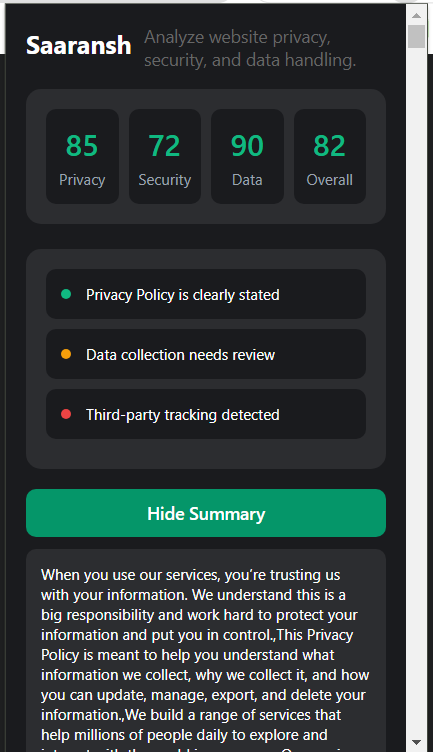

# Legalease-Lens

## Setup

1. Go to `chrome://extensions`.
2. Enabled Developer mode toggle on top right.
3. Click on Load unpacked on top left and upload this project directory to load the extension to Chrome.

Screenshots:

